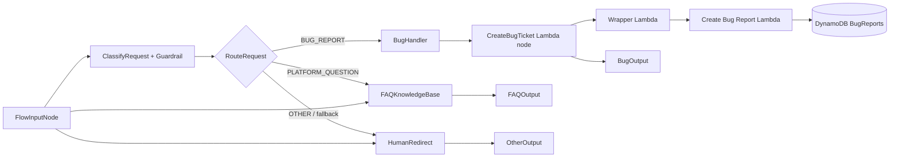

# Amazon Bedrock Customer Support Chatbot

A GitHub-ready reference implementation of a multi-path customer-support workflow built with **Amazon Bedrock Flows**, **AWS Lambda**, **Amazon DynamoDB**, **Amazon Bedrock Guardrails**, **Amazon Bedrock Knowledge Bases**, **Amazon S3**, and **Bedrock Evaluations**.

> This repository is a public-friendly reconstruction of the completed learning project. Resource IDs, account IDs, bucket names, ARNs, and phone numbers are intentionally parameterized or replaced with examples.

## What the project does

The chatbot classifies each customer message into one of three routes:

- `BUG_REPORT` — collect bug details, ask for missing information, create a real support ticket, and persist it to DynamoDB.
- `PLATFORM_QUESTION` — retrieve relevant FAQ content from a vector-backed Bedrock Knowledge Base and generate a grounded answer.
- `OTHER` — direct unsupported requests to human support.

The final project also adds:

- a Bedrock Guardrail on the classifier,
- edge-case and prompt-injection tests,
- automated JSONL generation for evaluation,
- Bedrock Automatic **LLM-as-a-Judge** evaluation,
- safe fallback routing for unexpected classifier output.

## Final architecture



## Why this architecture

The project intentionally separates **classification**, **routing**, **retrieval**, and **backend actions**:

- the classifier only labels the request;
- the condition node performs deterministic routing;
- the Knowledge Base handles FAQ retrieval and grounding;
- Lambda performs real backend work;
- DynamoDB proves the side effect actually happened.

During the original build, a Bedrock Agents Classic path was not available in the account, so the bug-ticket workflow was implemented with a Prompt node plus a Lambda adapter. The outcome is the same: required bug data is collected, the backend is invoked, and a real ticket is stored.

## Repository structure

```text
.
├── .github/workflows/validate.yml
├── docs/
│   ├── CLEANUP.md
│   ├── EVALUATION.md
│   ├── FLOW_BUILD.md
│   ├── GUARDRAIL.md
│   ├── KNOWLEDGE_BASE.md
│   ├── PROJECT_OBSERVATION.md
│   ├── SECURITY_AND_COST.md
│   └── SCREENSHOT_CHECKLIST.md
├── evaluation/
│   └── output_eval_dataset.example.jsonl
├── infrastructure/
│   ├── cloudformation-testing.yaml
│   └── cloudformation-tool.yaml
├── knowledge-base/
│   └── online_shop_faq.md
├── prompts/
│   ├── bug_handler.txt
│   ├── classifier.txt
│   └── human_redirect.txt
├── scripts/
│   ├── generate-eval-dataset.py
│   └── run-eval.ps1
├── src/lambdas/
│   ├── bedrock_flow_bug_wrapper.py
│   └── create_bug_report.py
├── tests/
│   └── flow-tests.json
├── .env.example
├── .gitignore
├── CONTRIBUTING.md
├── GITHUB_UPLOAD_STEPS.md
├── requirements.txt
└── SECURITY.md
```

## Prerequisites

- AWS account with access to Amazon Bedrock
- AWS CLI v2
- Python 3.11+
- `boto3`
- an Amazon Bedrock Flow and published alias
- a Bedrock Knowledge Base for the FAQ path
- a published Guardrail version for the classifier

Install Python dependencies:

```powershell
python -m pip install -r requirements.txt
```

Authenticate:

```powershell
aws login
aws sts get-caller-identity
```

Verify Python can also resolve AWS credentials:

```powershell
python -c "import boto3; print(boto3.client('sts', region_name='us-east-1').get_caller_identity())"
```

## 1. Deploy backend resources

The learning project uses CloudFormation for repeatable backend infrastructure.

```powershell
aws cloudformation deploy `
  --template-file .\infrastructure\cloudformation-tool.yaml `
  --stack-name online-shop-support-tool `
  --capabilities CAPABILITY_NAMED_IAM `
  --region us-east-1
```

The stack creates:

- DynamoDB bug-report table
- ticket-creation Lambda
- wrapper Lambda
- IAM roles and Lambda-to-Lambda invoke permission

See [docs/FLOW_BUILD.md](docs/FLOW_BUILD.md) for the Flow wiring.

## 2. Create the Knowledge Base

Upload the FAQ:

```powershell
aws s3 cp .\knowledge-base\online_shop_faq.md `
  s3://YOUR_BUCKET/knowledge-base/online_shop_faq.md `
  --region us-east-1
```

Create a **Managed Knowledge Base**, use S3 as the data source, sync the data source, and test retrieval before connecting it to the Flow.

See [docs/KNOWLEDGE_BASE.md](docs/KNOWLEDGE_BASE.md).

## 3. Add the Guardrail

Create and publish a guardrail, then attach the numbered version to `ClassifyRequest`.

See [docs/GUARDRAIL.md](docs/GUARDRAIL.md).

## 4. Validate the test suite

```powershell
python -m json.tool .\tests\flow-tests.json
```

The included suite covers normal requests plus:

- short bug messages,
- minimal-context requests,
- ambiguous mixed-intent requests,
- prompt-injection attempts.

## 5. Generate Bedrock Evaluation JSONL

```powershell
python .\scripts\generate-eval-dataset.py `
  --tests-json .\tests\flow-tests.json `
  --flow-id YOUR_FLOW_ID `
  --flow-alias-id YOUR_ALIAS_ID `
  --model-identifier OnlineShopCustomerSupportFlow `
  --out-jsonl .\output_eval_dataset.jsonl `
  --region us-east-1
```

A successful run should end with the same number of successful Flow calls as test cases.

Check for failures:

```powershell
Select-String -Path .\output_eval_dataset.jsonl -Pattern "FLOW_ERROR"
```

No output is good.

## Evaluation results from the completed project

| Metric | V1 | V2 expanded tests |
|---|---:|---:|
| Correctness | **1.00** | **1.00** |
| Completeness | 0.88 | 0.75 |
| Following Instructions | 0.83 | 0.50 |
| Helpfulness | 0.47 | **0.57** |

V2 used the expanded 10-test dataset. Correctness remained `1.00`, while the harder ambiguous/adversarial cases exposed opportunities to improve completeness and instruction following.

See [docs/EVALUATION.md](docs/EVALUATION.md).

## Important security note

Do **not** commit:

- AWS access keys or session tokens,
- `.env` files containing secrets,
- account-specific credentials,
- generated JSONL containing sensitive customer content,
- screenshots that expose information you do not intend to publish.

This repository intentionally uses placeholders for public sharing.

## Cleanup

After collecting your evidence, remove resources you no longer need to avoid ongoing charges.

See [docs/CLEANUP.md](docs/CLEANUP.md).

## Project outcome

The completed application demonstrated:

- deterministic multi-path routing,
- grounded RAG FAQ responses,
- harmful/prompt-injection protection,
- real Lambda/DynamoDB side effects,
- follow-up data collection,
- automated regression tests,
- published Flow version/alias invocation,
- LLM-as-a-Judge evaluation.

This repository is intended as a learning and portfolio reference. Review current AWS documentation before deployment because console labels and Bedrock capabilities can change.
